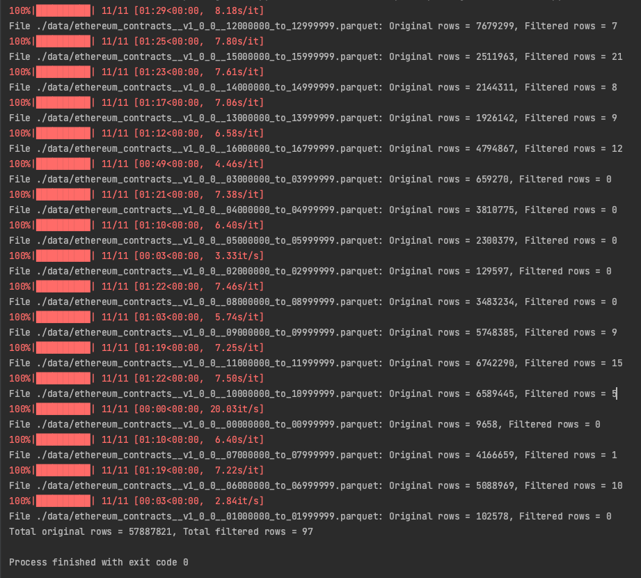

This code will get all contracts using the pairing precompile '0x8' in the format of 'PUSH1 0x8 GAS STATICCALL'

The /data folder should include the parquet files (1 to many) for ethereum contracts, I used:
https://github.com/paradigmxyz/paradigm-data-portal/tree/main/datasets/ethereum_contracts

The main.py will disassemble the 'code' column bytecode into readable opcodes, I used:
https://github.com/crytic/evm-opcodes

main.py will output the filtered results, includes 'PUSH1 0x8 GAS STATICCALL' into /results/output.parquet

output.parquet will include all original data columns as well as two new columns:
disassembled code and formatted contract address. clean_output.parquet will include only the two new columns.

